# Installation Kali Linux

Si vous êtes sur Windows et que vous voulez vous lancez dans la cybersécurité vous serez pratiquement obligé de passé par linux !

Nous allons voir comment installer un environnement de travail pour faire des tests de sécurité.

Ici, la distribution que nous allons intaller est **Kali Linux**. C'est une distribution basé sur debian qui a déjà énormément d'outils préinstaller sur le système ! C'est un système léger et facile à déployer !

### Téléchargement et installation

Pour ce faire rendez-vous sur le site de [Kali Linux :](https://www.kali.org/)


Vous pouvez cliquez sur le bouton **Download** qui vous amenera sur la page suivante :

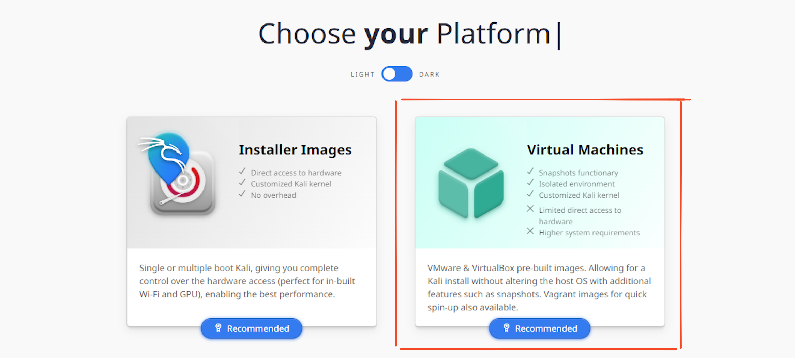

Vous pouvez constatez qu'il existe de nombreuse adaptation de Kali linux en fonction des différents sytemes mais celle qui va nous intéresser ici c'est la section **Virtual Machine**.

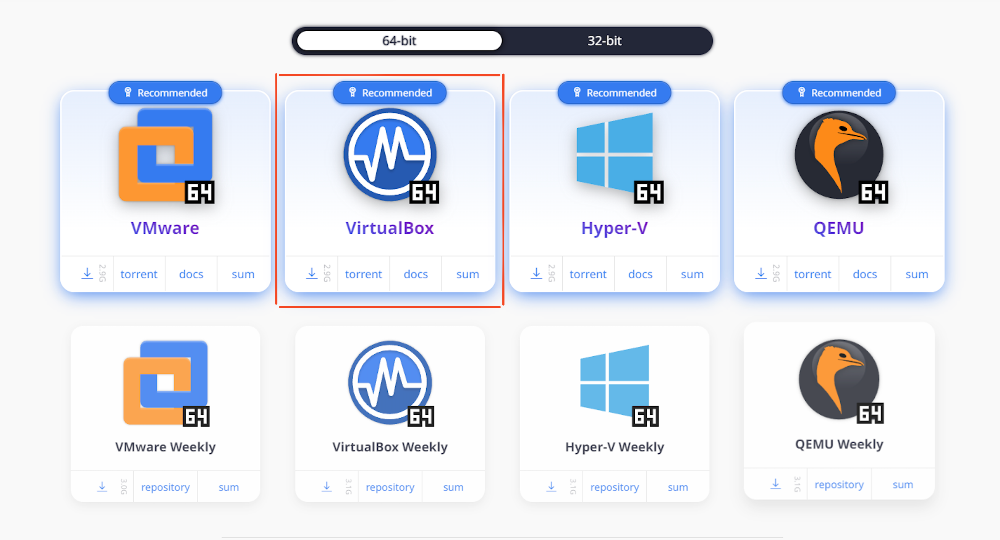

On peut ensuite selectionné la version classique et la télécharger !

Vous pouvez ensuite vous rendre sur le site de [VirtualBox](https://www.virtualbox.org/wiki/Downloads) le télécharger et l'installer.

Une fois lancé, voici ce que vous devriez obtenir :

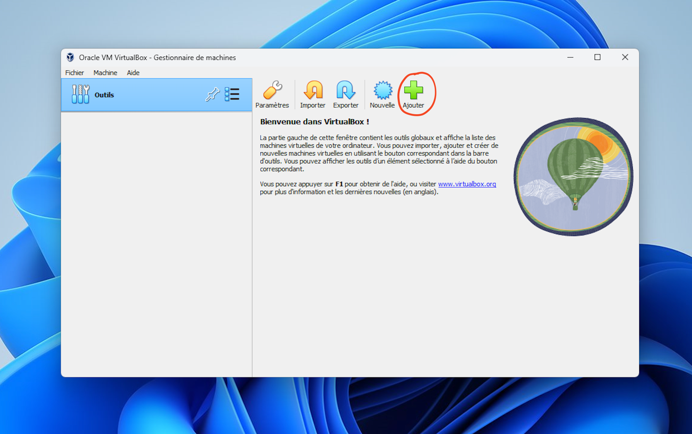

Cliquez ensuite sur "Ajouter".

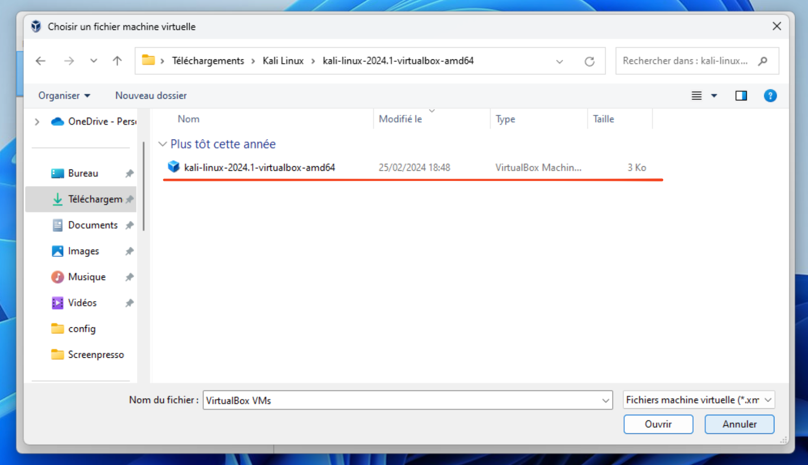

Selectionner l'image que vous venez de télécharger, puis sur ouvrir !

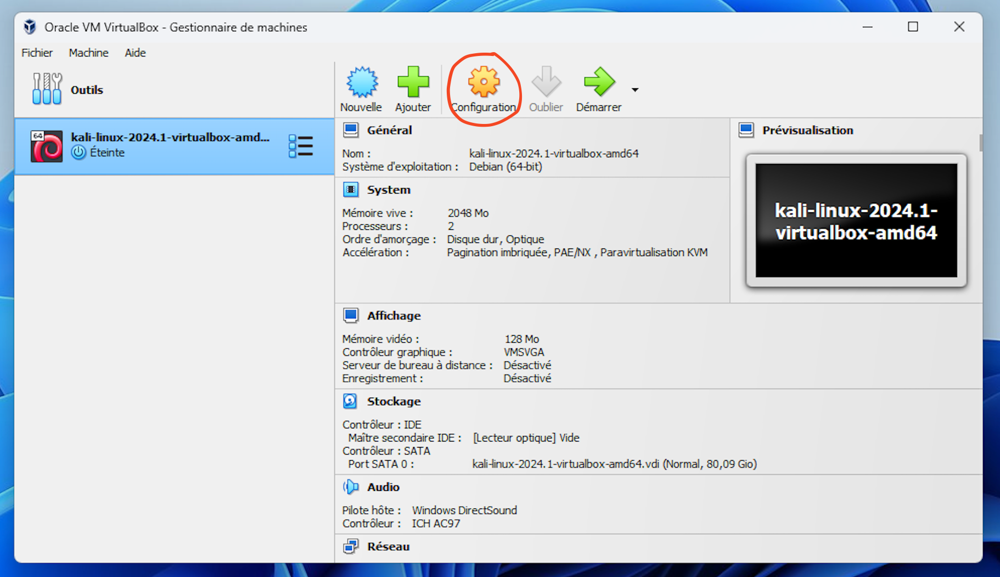

Rendez-vous ensuite dans l'onglet configuration avant de lancer la machine virtuelle !

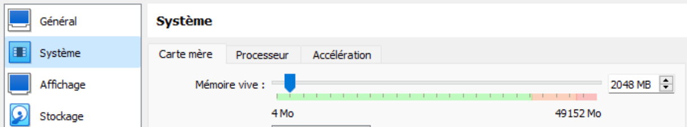

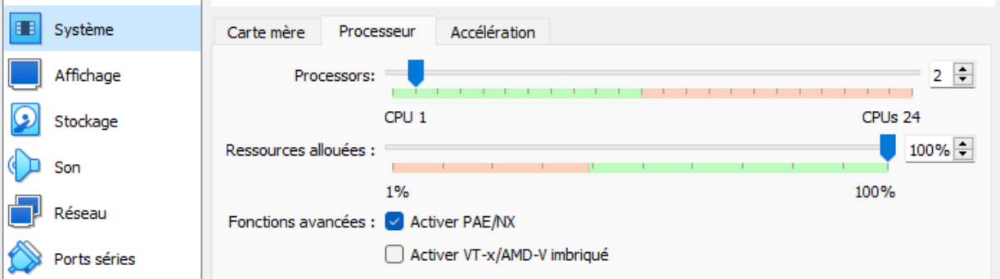

Ajustez la la ram et le nombre de processeur que vous souhaitez allouez à votre machine virtuelle.

Vous pouvez ensuite démarer la machine virtuelle et si tout fonctionne bien vous devriez arrivé sur la page suivante :


> Attention : Le clavier est en qwerty il faut donc taper sur votre clavier "kqli" pour que cela marque "kali"

**User : kali**
**password : kali**

### Mettre le clavier en AZERTY

Tout d'abord pour corriger le problème de manière temporaire vous pouvez simplement tapez :

```bash
setxkbmap fr
```

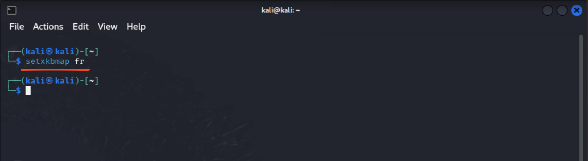

> Comment faire pour le changer de manière permanente ?

On va reconfigurer le clavier avec :

```bash
dpkg-reconfigure keyboard-configuration
```

Vous devriez arriver sur cette interface :

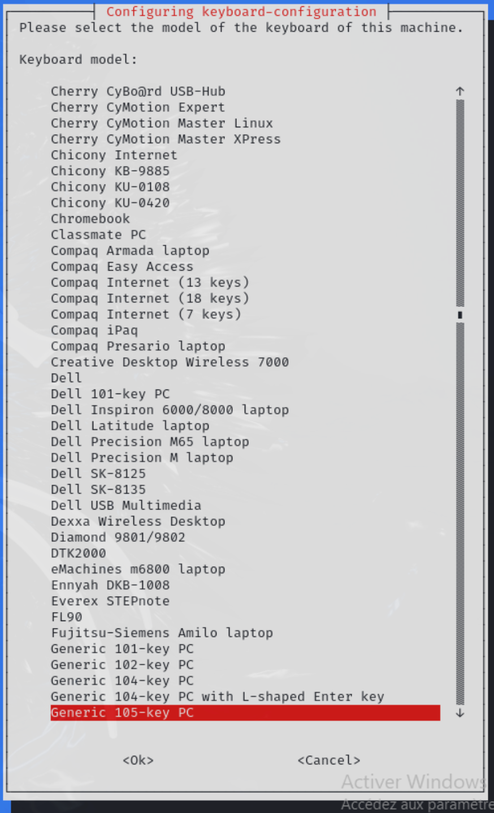

Selectionnez "Generic 105-key PC"

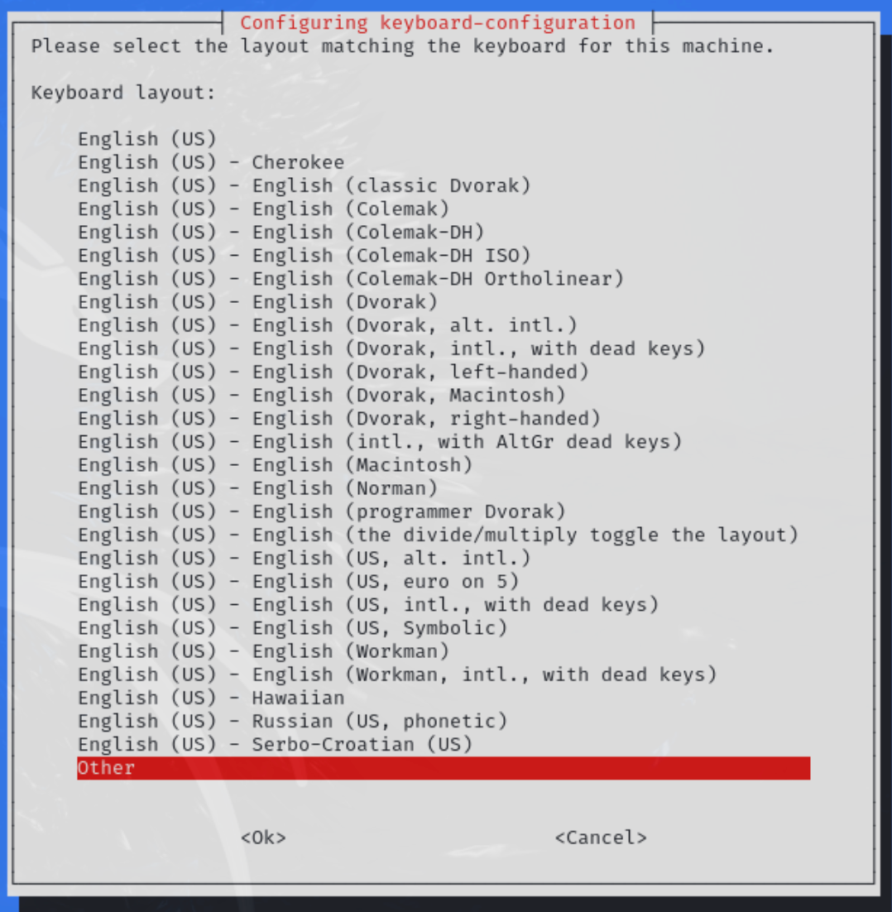

Selectionnez "Other"

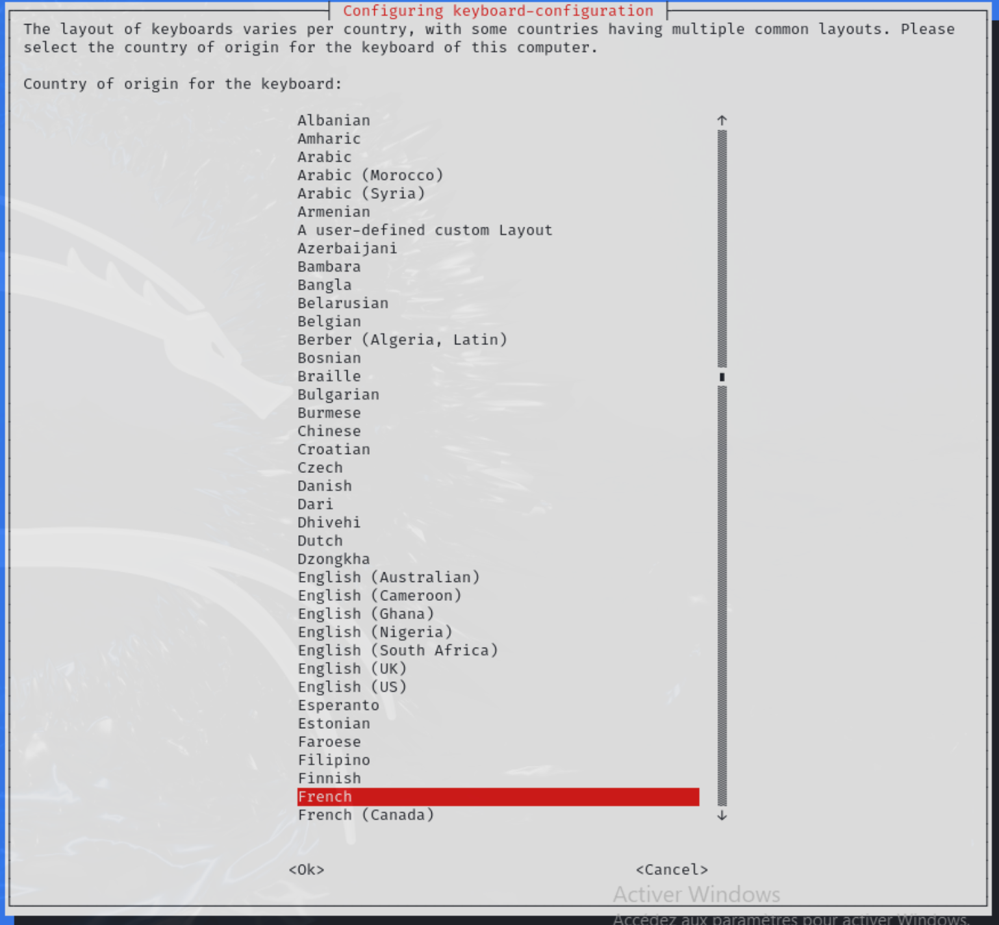

Puis cherchez "French" dans la liste

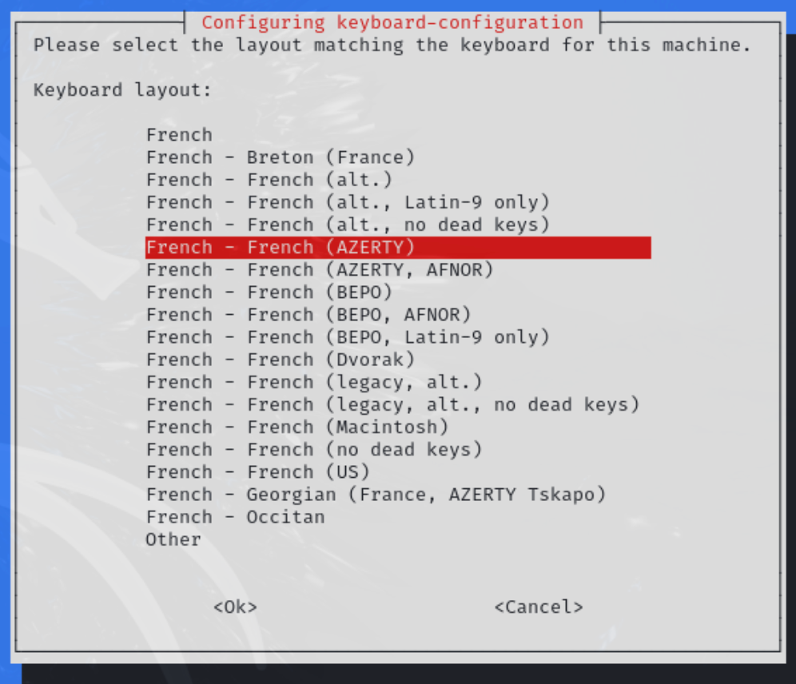

Puis selectionnez "French (AZERTY)" et ensuite vous pouvez simplement suivre les screens !

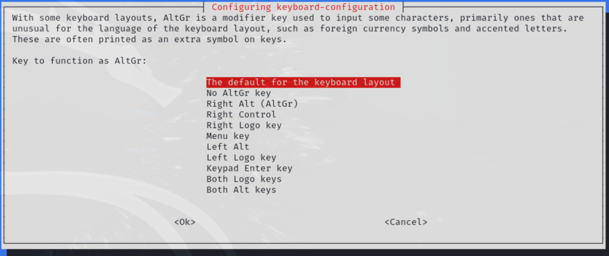

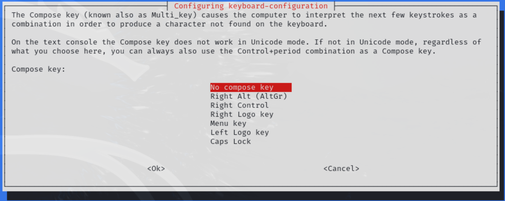

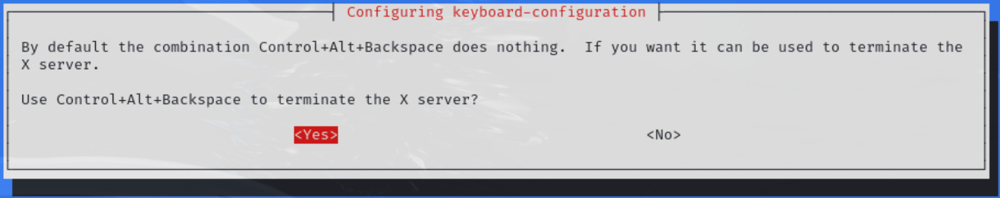

**Et voilà maintenant le clavier sera tout le temps en AZERTY ! Vous pouvez maintenant hacker votre première machine !**
